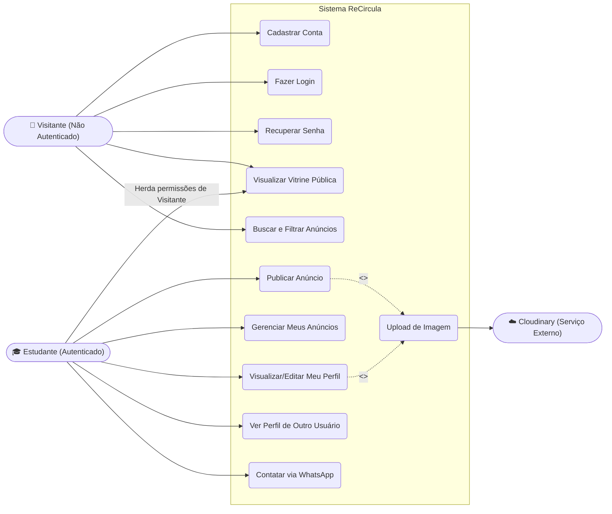
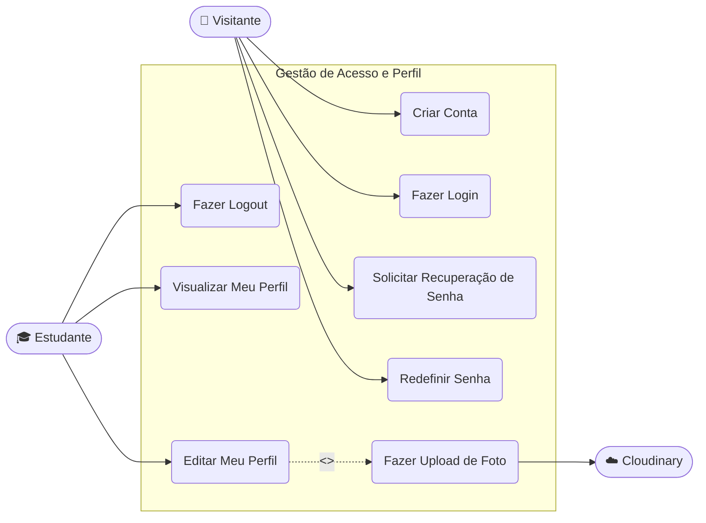
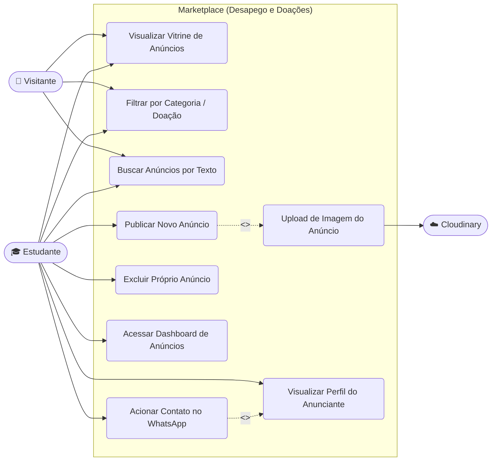

# Diagramas de Caso de Uso - ReCircula

Abaixo estão os diagramas de caso de uso do sistema **ReCircula**, modelados com base nos requisitos funcionais e atores definidos. A notação utilizada foi o formato de fluxograma (_flowchart_) do Mermaid.js, amplamente suportado nativamente pelo GitHub e outras ferramentas de Markdown.

## 1. Visão Geral (Atores Principais)

Este diagrama exibe a visão macro do sistema, destacando as interações primárias entre os visitantes, estudantes autenticados e o serviço externo de imagens.

---

## 2. Subsistema de Autenticação e Perfil

Focado exclusivamente nas operações de gestão de acesso à plataforma e edição das informações públicas do estudante.

---

## 3. Subsistema de Marketplace e Anúncios

Focado na essência da economia circular do projeto, detalhando a listagem, criação e interação com os anúncios da plataforma.

