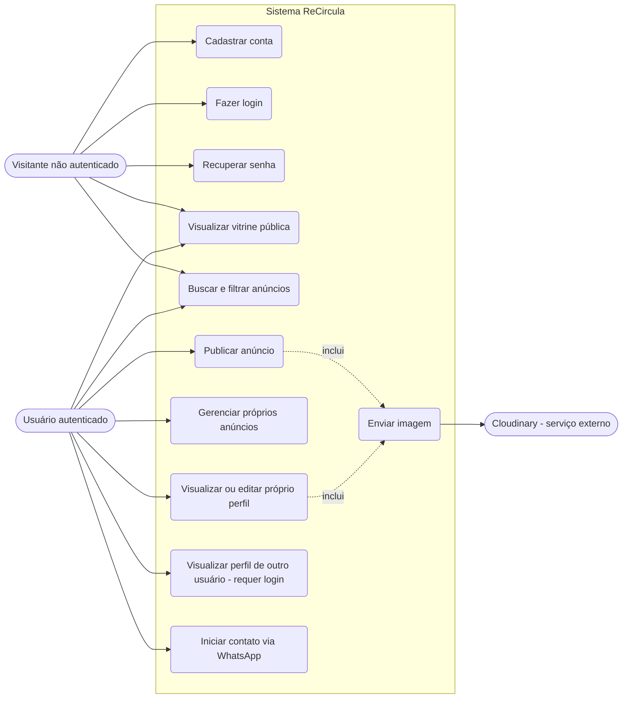
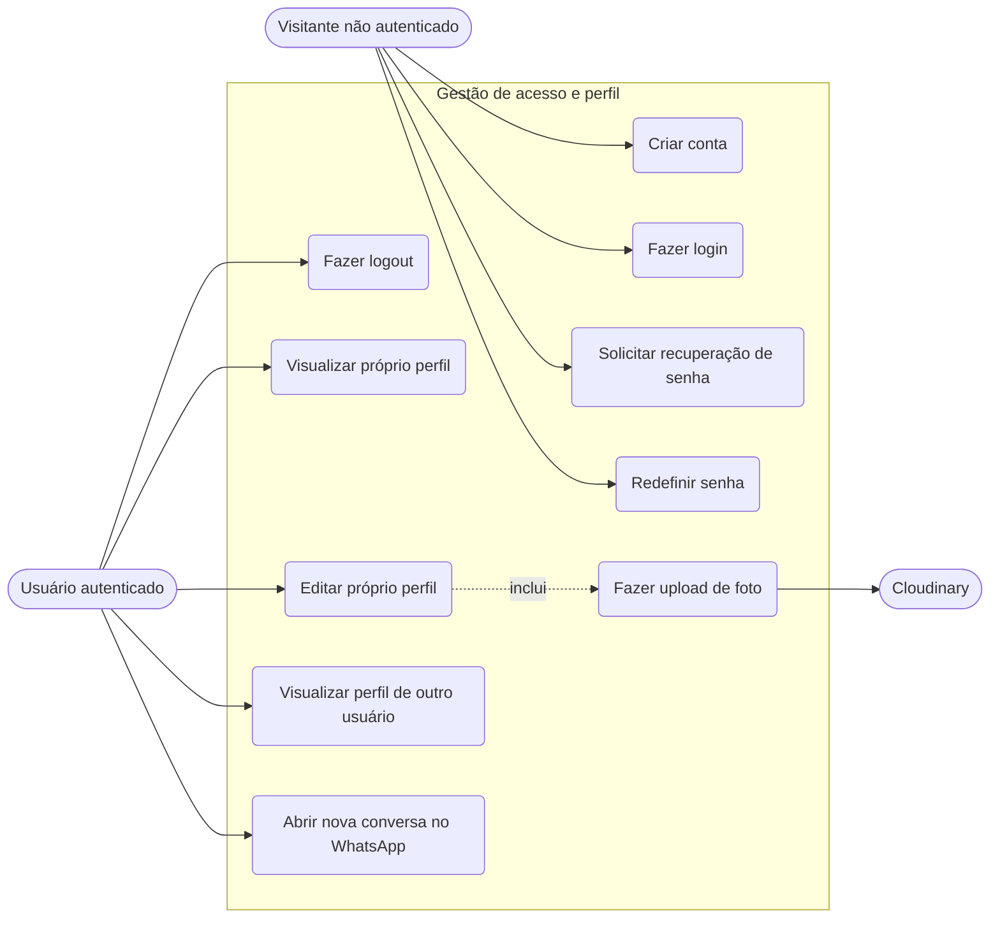
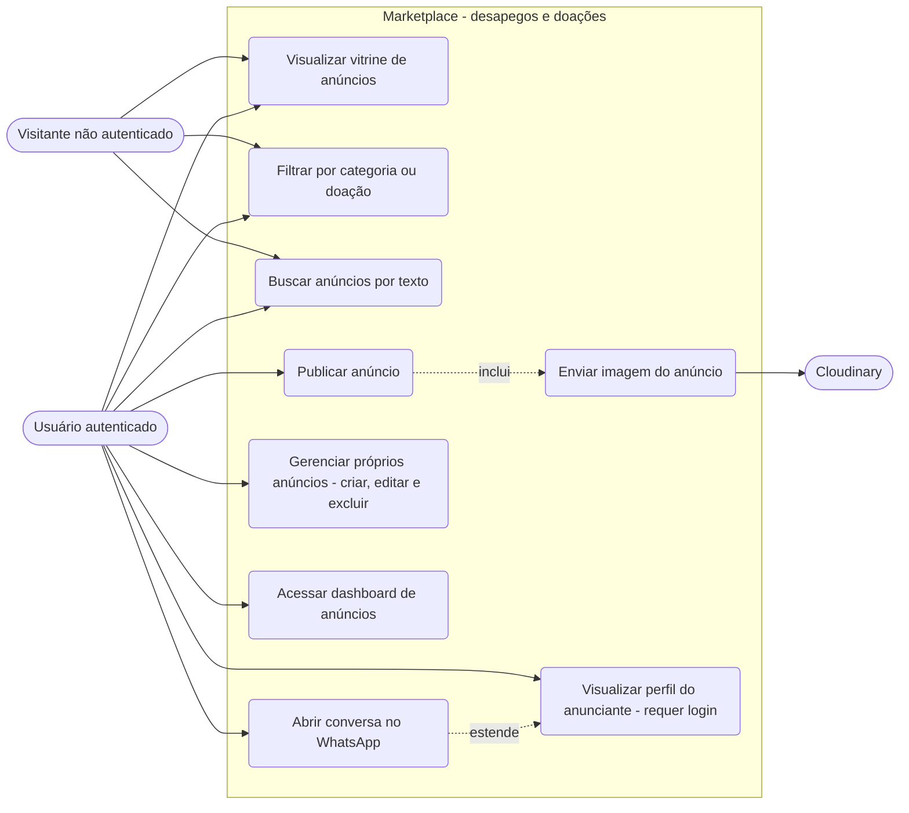
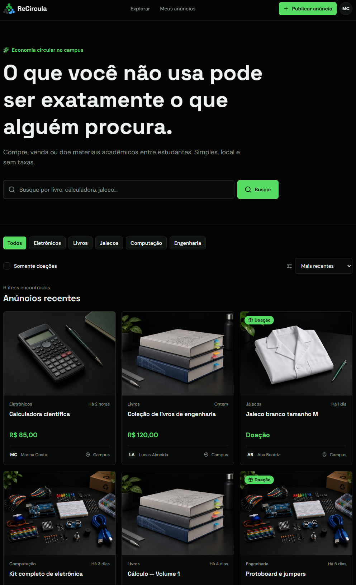
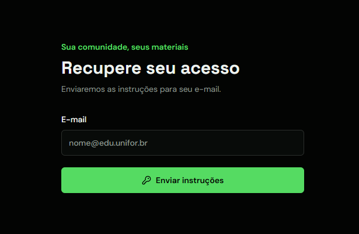
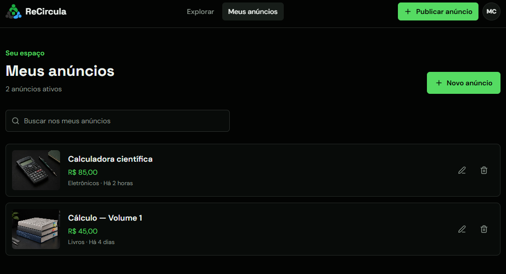
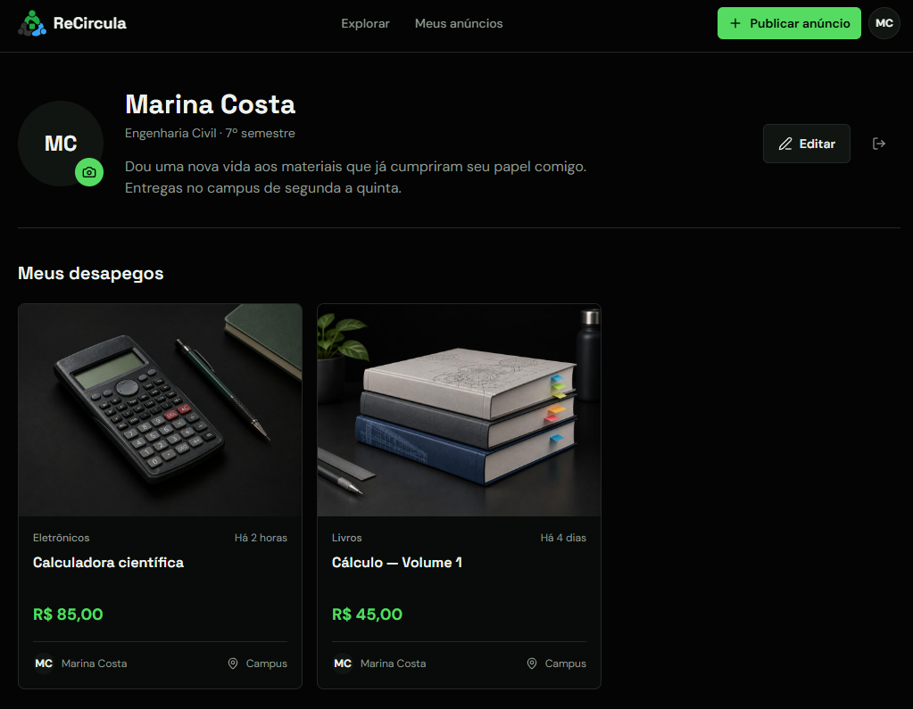
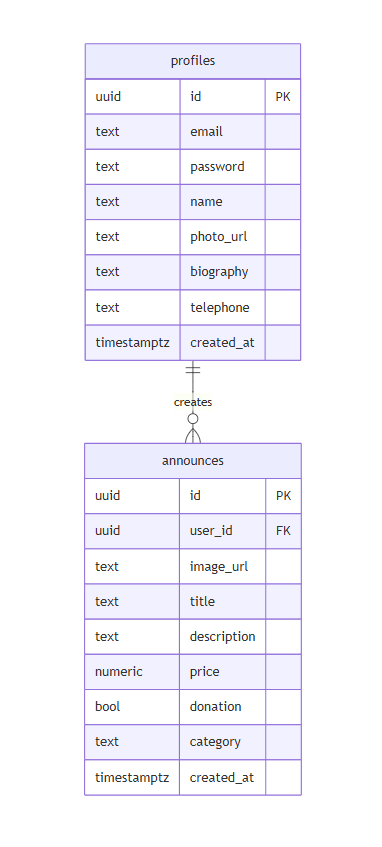
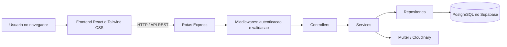

# ReCircula — Plano de Trabalho (Etapa 1)

**Disciplina:** Desenvolvimento Web  
**Instituição:** Universidade de Fortaleza (UNIFOR)  
**Entrega:** Etapa 1 — Plano de Trabalho  
**Equipe:** Samuel Miguel Barbosa, Henrique Lima e Miguel Cavalcante

> Este documento consolida o planejamento do projeto a partir do escopo, requisitos, diagramas, protótipos e arquivos da equipe. As tecnologias, funcionalidades e publicações descritas são planejadas; não representam, por si só, funcionalidades já implementadas.

## 1. Resumo do Projeto

O **ReCircula** é um marketplace voltado à comunidade universitária para reutilização, venda acessível e doação de materiais acadêmicos. A plataforma pretende aproximar pessoas que procuram livros, jalecos, calculadoras, componentes eletrônicos e outros itens daquelas que já não os utilizam. O contato entre as partes será direto, com um botão para iniciar uma nova conversa pelo WhatsApp; o sistema não processará pagamentos nem intermediará financeiramente as transações. O cadastro aceita qualquer endereço de e-mail válido, sem exigir e-mail universitário.

O problema abordado é a dificuldade de encontrar materiais acadêmicos usados em um canal centralizado e organizado. A solução busca reduzir custos para quem compra, facilitar o reaproveitamento para quem anuncia e incentivar práticas de economia circular na comunidade universitária.

## 2. Escopo e Público-Alvo

### 2.1 Funcionalidades principais planejadas

- Vitrine pública de anúncios com imagem, título, categoria, preço ou indicação de doação e nome/foto do anunciante quando disponíveis, sem exibir telefone ou e-mail.
- Busca textual por título, filtros por categoria e doação e ordenação por data ou preço.
- Cadastro, login, logout e recuperação de acesso.
- Publicação de anúncios por usuários autenticados, incluindo imagem, descrição, categoria, preço ou marcação de doação.
- Painel para consulta e gerenciamento dos próprios anúncios.
- Consulta autenticada de perfis de anunciantes, com nome, foto, biografia e anúncios publicados; telefone e e-mail não são exibidos, e o contato é feito por um botão para abrir o WhatsApp.
- Upload de imagens para anúncios e perfis.

### 2.2 Público-alvo

- **Estudantes ingressantes:** procuram materiais necessários para iniciar o curso com menor custo.
- **Estudantes veteranos e concluintes:** desejam vender ou doar materiais que deixaram de utilizar.
- **Demais integrantes da comunidade acadêmica:** professores, monitores e pesquisadores interessados em adquirir, oferecer ou reaproveitar materiais.

O marketplace é voltado à comunidade do campus, mas não exige comprovação de vínculo acadêmico para cadastro.

### 2.3 Limites do escopo

O ReCircula facilita a descoberta de itens e o contato entre os usuários. Pagamentos, logística de entrega e negociação não serão realizados pela plataforma; ficam a cargo dos envolvidos. A primeira entrega funcional prevista no cronograma é um MVP full-stack com os fluxos prioritários e publicação planejada ao final de quatro semanas.

## 3. Requisitos do Sistema

### 3.1 Atores do Sistema

| Ator                        | Descrição                                                                                                       |
| --------------------------- | --------------------------------------------------------------------------------------------------------------- |
| **Usuário não autenticado** | Visitante que acessa a landing page e pode navegar pela vitrine pública de anúncios. Não pode consultar perfis. |
| **Usuário autenticado**     | Pessoa com sessão ativa e acesso às operações protegidas do marketplace.                                        |
| **Backend (API REST)**      | Serviço intermediário que processa regras de negócio, autenticação própria com JWT e acesso aos dados.          |
| **Cloudinary**              | Serviço externo de armazenamento e entrega de imagens.                                                          |

### 3.2 Requisitos Funcionais

#### RF01 — Cadastro de usuário

- O sistema deve permitir que um novo usuário crie uma conta fornecendo **e-mail** e **senha**.
- Pode ser utilizado qualquer endereço de e-mail válido; não é exigido e-mail universitário.
- Ao criar a conta, um **perfil** é automaticamente vinculado ao usuário com nome, biografia, telefone e foto opcionais.

#### RF02 — Login de usuário

- O sistema deve permitir que um usuário registrado autentique-se com **e-mail** e **senha**.
- Após autenticação bem-sucedida, o sistema deve **redirecionar** o usuário para a página principal do marketplace.

#### RF03 — Logout

- O sistema deve permitir que o usuário encerre sua sessão ativa a qualquer momento.

#### RF04 — Recuperação de senha

- O sistema deve permitir que o usuário solicite a **recuperação de senha** informando seu e-mail.
- O sistema deve gerar e enviar um link/código de redefinição para o e-mail cadastrado.

#### RF05 — Redefinição de senha

- O sistema deve permitir que o usuário **redefina sua senha** ao acessar o link enviado por e-mail.
- O sistema deve exibir um formulário de redefinição de senha quando detectar que o usuário está em modo de recuperação.

#### RF06 — Persistência e renovação de sessão

- O sistema deve manter o usuário autenticado entre sessões (persistência de sessão).
- O token de acesso deve ser **atualizado automaticamente** antes do vencimento.

#### RF07 — Publicação de anúncio

- O usuário autenticado deve poder criar um novo anúncio fornecendo:
  - **Título** (obrigatório)
  - **Categoria** (obrigatório): Livros, Eletrônicos, Acessórios, Jalecos, Engenharia, Computação ou Móveis
  - **Descrição** (opcional)
  - **Imagem** (obrigatória, enviada via upload)
  - **Preço** (opcional numérico ≥ 0)
  - **Doação** (flag booleana — se marcada, o campo preço é desabilitado)

#### RF08 — Upload de imagem para anúncio

- O sistema deve permitir o upload de uma **imagem** associada ao anúncio ou ao perfil do usuário.
- A imagem deve ser enviada ao backend no formato `multipart/form-data` e armazenada no **Cloudinary**.
- O sistema deve retornar a URL segura (`secure_url`) da imagem após o upload.

#### RF09 — Listagem pública de anúncios

- O sistema deve exibir todos os anúncios publicados para **qualquer visitante** (autenticado ou não).
- Os anúncios devem exibir: imagem, título, categoria, preço (ou indicativo de doação), nome e foto do anunciante quando disponíveis.
- E-mail e telefone do anunciante não devem ser exibidos na interface.

#### RF10 — Busca de anúncios por texto

- O sistema deve permitir buscar anúncios por **texto livre** no título.
- A busca deve utilizar **debounce de 500ms** para evitar requisições excessivas.

#### RF11 — Filtro por categoria

- O sistema deve permitir filtrar anúncios por uma **categoria específica**.
- A lista de categorias disponíveis deve ser carregada dinamicamente a partir dos anúncios existentes.

#### RF12 — Filtro por doação

- O sistema deve permitir filtrar para exibir apenas anúncios marcados como **doação**.

#### RF13 — Ordenação de anúncios

- O sistema deve permitir ordenar os anúncios por:
  - **Mais recente** (`recent`)
  - **Menor preço** (`price-asc`)
  - **Maior preço** (`price-desc`)

#### RF14 — Exclusão de anúncio

- O usuário autenticado deve poder **excluir seus próprios anúncios**.
- O sistema deve exibir uma **confirmação** antes de executar a exclusão.
- A exclusão requer conexão ativa com a internet para confirmação e sincronização com o backend.

#### RF15 — Visualização do perfil próprio

- O usuário autenticado deve poder visualizar seu próprio perfil com: foto, nome, biografia e lista de anúncios publicados.
- O telefone é um dado privado, não deve ser apresentado como texto na interface e pode ser mantido para gerar o link de contato via WhatsApp.

#### RF16 — Visualização de perfil de outro usuário

- Somente um usuário autenticado pode visualizar o perfil de **outro usuário** pelo seu ID, com foto, nome, biografia e galeria de anúncios.
- E-mail e telefone não devem ser exibidos como texto na interface.

#### RF17 — Edição de perfil

- O usuário autenticado deve poder editar as seguintes informações do próprio perfil:
  - **Nome** (mínimo 2 caracteres)
  - **Biografia** (máximo 150 caracteres)
  - **Telefone** (máximo 20 caracteres, com formatação automática)
  - **Foto de perfil** (upload de imagem via Cloudinary)

#### RF18 — Contato via WhatsApp

- Ao visualizar o perfil de outro usuário, deve existir um botão que **abra uma nova conversa no WhatsApp** com mensagem pré-preenchida, caso o anunciante tenha informado seu telefone.
- O número de telefone não deve ser exibido visualmente; o contato ocorre pelo botão.

#### RF19 — Dashboard de anúncios do usuário

- O usuário autenticado deve poder acessar um painel listando **apenas seus próprios anúncios**, com suporte a todos os filtros (texto, categoria, doação e ordenação).

### 3.3 Requisitos Não Funcionais

#### RNF01 — Autenticação e segurança de tokens

- A autenticação deve utilizar **JWT** (JSON Web Token) gerado e validado diretamente pelo próprio backend (Node.js/Express) com senhas criptografadas via **bcrypt**.
- O token de acesso deve ser enviado no cabeçalho HTTP `Authorization: Bearer <token>` em todas as rotas protegidas.
- As credenciais de conexão ao banco de dados (Supabase/PostgreSQL) e a chave secreta do JWT devem permanecer **exclusivamente no backend** via variáveis de ambiente (`.env`) e jamais ser expostas ao frontend.

#### RNF02 — Autorização e controle de acesso

- O backend deve implementar middlewares de controle de acesso e autorização baseados no identificador do usuário validado no token JWT.
- Usuários só podem **atualizar e excluir** seus próprios anúncios e perfil.
- Anúncios são legíveis por qualquer visitante, sem exigência de login.
- A consulta de perfis exige autenticação; visitantes não autenticados não podem consultar perfis próprios ou de outros usuários.
- E-mail e telefone não devem ser apresentados na interface como dados públicos do perfil.
- O backend deve validar a propriedade do recurso antes de permitir operações de escrita ou exclusão.

#### RNF03 — Validação de dados

- Todas as entradas do usuário devem ser validadas no **backend** usando a biblioteca **Zod**.
- Campos inválidos devem retornar erro HTTP `400` com mensagem descritiva.
- A validação deve incluir: tipos de dados, comprimento mínimo/máximo e campos obrigatórios.

#### RNF04 — Tratamento centralizado de erros

- O backend deve utilizar um **middleware global de erros** para padronizar as respostas de erro.
- As respostas de erro devem seguir códigos HTTP semânticos: 400, 401, 403, 404, 500, 503.
- Falhas de conexão com a base de dados ou indisponibilidade de serviços externos devem retornar HTTP `503`.

#### RNF05 — Performance — Cache Stale While Revalidate

- O frontend deve implementar a estratégia de cache **Stale While Revalidate (SWR)**:
  - Exibir dados em cache imediatamente (resposta instantânea ao usuário).
  - Atualizar os dados em segundo plano de forma transparente.
- O cache deve ser **identificado por chave** composta pelos parâmetros da requisição.
- Um toast de "carregando" deve ser exibido somente se a atualização em segundo plano demorar mais de **1 segundo**.

#### RNF06 — Performance — Debounce de busca

- A busca por texto deve aplicar **debounce de 500ms** antes de disparar a requisição ao backend.

#### RNF07 — Responsividade

- A interface deve ser **totalmente responsiva**, adaptando-se a dispositivos móveis e desktops.
- Layouts e espaçamentos devem se ajustar automaticamente via **TailwindCSS**.

#### RNF08 — Usabilidade — Feedback visual

- O sistema deve exibir **indicadores de carregamento** (Spinner) durante operações assíncronas.
- O sistema deve emitir **Toasts independentes** para sucesso, erro e progresso, sem que o fechamento de um interfira nos demais.
- Cada Toast deve possuir um **ID único** e **timer independente**.

#### RNF09 — Arquitetura em camadas (Backend)

- O backend deve seguir a arquitetura: **Routes → Middlewares → Controllers → Services → Repository → Supabase**.
- Cada camada deve ter responsabilidade única e bem definida.
- A separação deve facilitar testes unitários, manutenção e evolução independente de cada camada.

#### RNF10 — Padronização em JavaScript (ES6+)

- Todo o código (frontend e backend) deve ser escrito em **JavaScript moderno (ES6+)**, utilizando módulos ES (`import`/`export`), funções assíncronas (`async`/`await`) e padrões consistentes de codificação.
- Constantes, modelos de dados e utilitários devem ser organizados em módulos dedicados para facilitar a manutenção.

#### RNF11 — Escalabilidade da API

- A API REST deve suportar **múltiplos filtros combinados** em uma única requisição (categoria + busca + doação + ordenação + user_id).
- A lógica de filtragem deve ser reutilizada entre a listagem pública e o dashboard do usuário.

#### RNF12 — Upload de imagens

- O upload de imagens deve ser processado via **Multer** no backend (parse de `multipart/form-data`).
- As imagens devem ser armazenadas no **Cloudinary** e referenciadas apenas pela URL pública gerada.
- O sistema requer conexão ativa com a internet para upload e persistência de imagens.

#### RNF13 — Implantação e infraestrutura

- O **frontend** deve ser implantado no **Vercel** com domínio público acessível.
- O **backend** deve ser implantado no **Render** e consumido exclusivamente pelo frontend.
- O banco de dados deve ser hospedado no **Supabase** (PostgreSQL gerenciado).
- As variáveis de ambiente sensíveis não devem ser versionadas no repositório.

### 3.4 Regras de Negócio

| ID   | Regra                                                                                                            |
| ---- | ---------------------------------------------------------------------------------------------------------------- |
| RN01 | Um anúncio marcado como **doação** não pode ter preço preenchido.                                                |
| RN02 | O preço de um anúncio, quando informado, deve ser **maior ou igual a zero**.                                     |
| RN03 | Somente o **dono do anúncio** pode editá-lo ou excluí-lo.                                                        |
| RN04 | Somente o **dono do perfil** pode editá-lo.                                                                      |
| RN05 | O botão de contato via WhatsApp só é exibido ao visualizar o **perfil de outro usuário** (não o próprio).        |
| RN06 | Operações de escrita (criar, editar, excluir) **requerem conexão com a internet**.                               |
| RN07 | O campo telefone é formatado automaticamente conforme o usuário digita.                                          |
| RN08 | A biografia do perfil está limitada a **150 caracteres** tanto no backend quanto no campo de edição do frontend. |

## 4. Casos de Uso e Fluxos

Os diagramas a seguir apresentam os atores e fluxos planejados. A vitrine e os anúncios podem ser consultados sem autenticação; a consulta de perfis de outras pessoas e o contato via WhatsApp exigem uma sessão autenticada.

### 4.1 Visão Geral (Atores Principais)

O diagrama mostra as interações entre visitantes, usuários autenticados e o serviço externo de imagens.

### 4.2 Subsistema de Autenticação e Perfil

Visitantes podem criar conta, entrar e iniciar a recuperação de senha. A consulta e a edição de perfis, inclusive de outro usuário, requerem autenticação. O telefone não é apresentado como texto; o contato é iniciado pelo botão do WhatsApp.

### 4.3 Subsistema de Marketplace e Anúncios

Visitantes e usuários autenticados consultam, pesquisam e filtram anúncios. Apenas usuários autenticados gerenciam seus próprios anúncios e acessam perfis de anunciantes.

## 5. Protótipos de Interface

- [Home](#home)
- [Sign In](#sign-in)
- [Sign Up](#sign-up)
- [Recovery](#recovery)
- [To Announce](#to-announce)
- [Dashboard](#dashboard)
- [Profile](#profile)

O conjunto contém sete telas de referência para a navegação, autenticação, consulta e gestão de anúncios e perfil.

### Home

Tela inicial de apresentação do ReCircula, que introduz o marketplace e direciona à consulta dos anúncios.

### Sign In

Tela para autenticação de uma conta existente por e-mail e senha.

### Sign Up

Tela de cadastro de uma nova conta. A menção visual a e-mail universitário é apenas sugestiva: qualquer e-mail válido pode ser utilizado.

### Recovery

Tela para solicitar a recuperação de acesso por e-mail.

### To Announce

Tela de formulário para cadastrar um anúncio, informar seus dados e selecionar uma imagem.

### Dashboard

Painel para consultar e gerenciar os anúncios publicados pelo usuário autenticado.

### Profile

Tela de perfil próprio ou de outro usuário autenticado, com informações de perfil e anúncios. O telefone não é apresentado como texto; quando disponível, o contato é iniciado pelo botão do WhatsApp.

A redefinição de senha e a consulta de perfil de outro usuário autenticado são estados adicionais previstos, sem imagens próprias neste conjunto.

## 6. Modelo de Dados

O modelo relacional planejado possui duas entidades principais. Cada perfil pode publicar vários anúncios; cada anúncio pertence a um único perfil (`profiles 1:N announces`). A senha é criptografada com bcrypt e armazenada no campo `password`; o Supabase é o serviço de banco de dados, não o provedor de autenticação.

### Diagrama Entidade-Relacionamento

### Entidade `profiles`

| Campo        | Tipo        | Restrição e finalidade                                                                                                             |
| ------------ | ----------- | ---------------------------------------------------------------------------------------------------------------------------------- |
| `id`         | UUID        | Chave primária.                                                                                                                    |
| `email`      | TEXT        | Obrigatório e único; pode ser qualquer e-mail válido.                                                                              |
| `password`   | TEXT        | Obrigatório; armazena a senha criptografada com bcrypt.                                                                            |
| `name`       | TEXT        | Nome do usuário.                                                                                                                   |
| `photo_url`  | TEXT        | URL da foto de perfil; opcional.                                                                                                   |
| `biography`  | TEXT        | Biografia; opcional, limitada a 150 caracteres.                                                                                    |
| `telephone`  | TEXT        | Telefone privado, opcional, com até 20 caracteres; usado para gerar o link de WhatsApp e não exibido como texto a outros usuários. |
| `created_at` | TIMESTAMPTZ | Data de criação, com valor padrão `now()`.                                                                                         |

### Entidade `announces`

| Campo         | Tipo        | Restrição e finalidade                                                                                                |
| ------------- | ----------- | --------------------------------------------------------------------------------------------------------------------- |
| `id`          | UUID        | Chave primária.                                                                                                       |
| `user_id`     | UUID        | Obrigatório; chave estrangeira para `profiles(id)`, com exclusão em cascata.                                          |
| `image_url`   | TEXT        | URL da imagem obrigatória do anúncio.                                                                                 |
| `title`       | TEXT        | Título obrigatório.                                                                                                   |
| `description` | TEXT        | Descrição opcional.                                                                                                   |
| `category`    | TEXT        | Categoria obrigatória.                                                                                                |
| `price`       | NUMERIC     | Opcional; quando informado, deve ser maior ou igual a zero. Não deve ser preenchido quando `donation` for verdadeiro. |
| `donation`    | BOOLEAN     | Indicador obrigatório de doação.                                                                                      |
| `created_at`  | TIMESTAMPTZ | Data de criação, com valor padrão `now()`.                                                                            |

## 7. Arquitetura e Tecnologias Planejadas

A proposta é uma aplicação full-stack desacoplada, com frontend React consumindo uma API REST em Node.js/Express. O backend organiza responsabilidades em rotas, middlewares, controllers, services e repositórios. A API acessa o PostgreSQL hospedado no Supabase; a autenticação é própria, usando JWT e bcrypt, e não é delegada ao Supabase Auth. Uploads passam pelo backend e são armazenados no Cloudinary.

| Camada       | Tecnologia planejada       | Papel no sistema                                                                              |
| ------------ | -------------------------- | --------------------------------------------------------------------------------------------- |
| Interface    | React.js e JavaScript ES6+ | SPA e componentes de interface.                                                               |
| Estilos      | Tailwind CSS               | Construção de layouts responsivos, com abordagem mobile-first.                                |
| API          | Node.js e Express          | API REST e regras de negócio organizadas em camadas.                                          |
| Validação    | Zod                        | Validação dos dados recebidos pelo backend.                                                   |
| Persistência | PostgreSQL no Supabase     | Armazenamento relacional de perfis e anúncios.                                                |
| Autenticação | JWT e bcrypt               | O backend emite/valida tokens e verifica senhas criptografadas; não se utiliza Supabase Auth. |
| Imagens      | Multer e Cloudinary        | Recepção dos arquivos e armazenamento de imagens na nuvem.                                    |
| Hospedagem   | Vercel e Render            | Frontend na Vercel e API no Render; banco no Supabase.                                        |

As credenciais e chaves secretas devem permanecer em variáveis de ambiente no backend, sem serem expostas ao frontend ou versionadas no repositório. As escolhas acima são as registradas no planejamento e ainda devem ser validadas na implementação.

## 8. API Planejada

As rotas protegidas utilizam `Authorization: Bearer <access_token>`, exceto `/auth/refresh`, que usa um token de renovação válido. Os dados de propriedade são obtidos da identidade autenticada, não de um `user_id` enviado pelo cliente.

### 8.1 Autenticação e sessão

| Método | Rota                    | Acesso               | Operação                                                               |
| ------ | ----------------------- | -------------------- | ---------------------------------------------------------------------- |
| `POST` | `/auth/register`        | Público              | Cadastro com qualquer e-mail válido e senha; criação de perfil.        |
| `POST` | `/auth/login`           | Público              | Verificação de senha com bcrypt e emissão dos tokens de sessão.        |
| `POST` | `/auth/logout`          | Autenticado          | Encerramento da sessão e invalidação do token de renovação associado.  |
| `POST` | `/auth/refresh`         | Token de renovação   | Emissão de novo token de acesso a partir de token de renovação válido. |
| `POST` | `/auth/forgot-password` | Público              | Solicitação de recuperação de senha por e-mail.                        |
| `POST` | `/auth/reset-password`  | Token de recuperação | Redefinição de senha usando token/código enviado por e-mail.           |

### 8.2 Anúncios

| Método   | Rota             | Acesso                    | Operação                                                                                   |
| -------- | ---------------- | ------------------------- | ------------------------------------------------------------------------------------------ |
| `GET`    | `/announces`     | Público                   | Lista anúncios com filtros opcionais `search`, `category`, `donation`, `sort` e `user_id`. |
| `GET`    | `/announces/:id` | Público                   | Consulta anúncio por ID sem expor e-mail ou telefone do anunciante.                        |
| `POST`   | `/announces`     | Autenticado               | Cria anúncio para o usuário da sessão.                                                     |
| `PATCH`  | `/announces/:id` | Autenticado, proprietário | Atualiza anúncio próprio após validar propriedade.                                         |
| `DELETE` | `/announces/:id` | Autenticado, proprietário | Exclui anúncio próprio após validar propriedade.                                           |

`sort` aceita `recent`, `price-asc` ou `price-desc`; `donation` é booleano. A busca textual considera o título. Os filtros podem ser combinados e `user_id` pode limitar resultados aos anúncios de um usuário para o dashboard.

### 8.3 Perfis

| Método  | Rota            | Acesso      | Operação                                                                                                                     |
| ------- | --------------- | ----------- | ---------------------------------------------------------------------------------------------------------------------------- |
| `GET`   | `/profiles/me`  | Autenticado | Consulta do próprio perfil; dados privados necessários à gestão ficam disponíveis somente ao proprietário.                   |
| `PATCH` | `/profiles/me`  | Autenticado | Atualização do próprio nome, biografia, telefone e foto.                                                                     |
| `GET`   | `/profiles/:id` | Autenticado | Consulta de perfil de outro usuário. Visitantes não autenticados não têm acesso; e-mail e telefone são omitidos da resposta. |

Quando houver telefone cadastrado, a consulta do perfil poderá fornecer um link para abrir uma nova conversa no WhatsApp pelo botão de contato, sem apresentar o número como texto na interface.

### 8.4 Upload

| Método | Rota      | Acesso      | Operação                                                                                                  |
| ------ | --------- | ----------- | --------------------------------------------------------------------------------------------------------- |
| `POST` | `/upload` | Autenticado | Recebe imagem em `multipart/form-data`, processa com Multer, armazena no Cloudinary e retorna URL segura. |

### 8.5 Validação e erros

As entradas são validadas no backend com Zod. Erros previstos usam códigos HTTP semânticos: `400` para entrada inválida, `401` para ausência de autenticação, `403` para falta de autorização, `404` para recurso inexistente, `500` para erro interno e `503` para indisponibilidade de banco ou serviço externo. Credenciais do banco, segredo JWT e credenciais externas ficam em variáveis de ambiente no backend.

## 9. Equipe e Responsabilidades

| Integrante            | Matrícula | Responsabilidade principal                                                                  |
| --------------------- | --------- | ------------------------------------------------------------------------------------------- |
| Samuel Miguel Barbosa | 2517428   | Frontend, UX/UI, gerência do projeto, autenticação e QA de frontend; coordenação da integração e dos critérios de aceite. |
| Henrique Lima         | 2520384   | Backend, autenticação, autorização e perfis.                                                |
| Miguel Cavalcante     | 2517384   | Backend, banco de dados, anúncios e uploads.                                                |

A divisão detalhada por semana está registrada em [responsabilidades.md](../../equipe/responsabilidades.md) e [cronograma_dev.md](../../equipe/cronograma_dev.md).

## 10. Cronograma de Execução

O plano prevê **quatro semanas (20 dias úteis)**, com acompanhamento diário e revisão dos marcos ao final de cada semana.

| Período                           | Atividades principais                                                                                                                                | Marco esperado                                                                                            |
| --------------------------------- | ---------------------------------------------------------------------------------------------------------------------------------------------------- | --------------------------------------------------------------------------------------------------------- |
| Semana 1 — Fundação e contratos   | Estruturar React e Express, estabelecer validações e tratamento de erros, criar scripts SQL e alinhar o contrato inicial da API.                     | Aplicação e API inicializadas; banco reproduzível por scripts; contrato inicial alinhado.                 |
| Semana 2 — Autenticação e vitrine | Concluir cadastro/login, sessão e recuperação; implementar listagem pública, busca, filtros, ordenação e interface da vitrine.                       | Visitante consulta anúncios filtrados; usuário consegue criar conta, autenticar-se e iniciar recuperação. |
| Semana 3 — Anúncios e perfis      | Implementar publicação e gestão de anúncios, dashboard, perfis, uploads e contato via WhatsApp.                                                      | Usuário autenticado publica e gerencia anúncios; perfis e imagens integrados.                             |
| Semana 4 — Integração e entrega   | Realizar testes de integração e regressão, corrigir defeitos, validar scripts e responsividade, publicar serviços e preparar demonstração/relatório. | Frontend na Vercel, API no Render e banco Supabase; fluxos prioritários verificados em desktop e celular. |

Os últimos três dias úteis ficam reservados à integração, correções e ensaio da apresentação, sem iniciar funcionalidades novas, conforme o cronograma da equipe.
